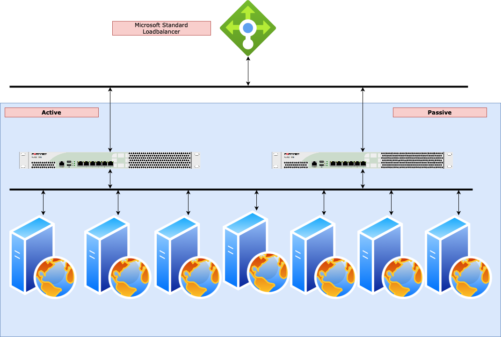

# Deployment templates for FortiADC in Microsoft Azure

## FortiADC Overview

FortiADC enhances the scalability, performance, and security of your applications whether they are hosted on premises or in the cloud. FortiADC is an advanced application delivery controller that optimizes application performance and availability while securing the application both with its own native security tools and by integrating application delivery into the Fortinet Security Fabric.

FortiADC provides unmatched application acceleration, load balancing, and web security, regardless of whether it is used for applications within a single data center or serves multiple applications for millions of users around the globe. FortiADC includes application acceleration, WAF, IPS, SSLi, link load balancing, and user authentication in one solution to deliver availability, performance, and security in a single, all-inclusive license.

more information: [FortiADC landing page](https://www.fortinet.com/products/application-delivery-controller/fortiadc#overview)

## Use cases

The FortiADC can be used in different scenario's to protect assets deployed in Microsoft Azure Virtual Networks.

- Enterprise-class layer 4-7 ADC
- Disaster recovery with global server load balancing
- Secure applications with a full-featured web application firewall
- DDoS application, web filtering, IPS, Geo-IP and IP reputation for enhanced security

Click [here](https://www.fortinet.com/products/public-cloud-security/azure#usecases) for a general overview of the different public cloud use cases.

## Resiliency and High Availability

When designing a reliable architecture in Microsoft Azure it is important to take resiliency and High Availability into account. Microsoft has the [Microsoft Azure Well-Architected Framework](https://docs.microsoft.com/en-us/azure/architecture/framework/resiliency/overview) available.

Running the FortiADC inside of Microsoft Azure can offer different levels of reliability based on these building blocks

### SLA

Microsoft offers different [SLAs](https://azure.microsoft.com/en-au/support/legal/sla/virtual-machines/) on Microsoft Azure based on the deployment used.
- [Availability Zone](AvailabilityZones/) (different datacenter in the same region): 99,99%
- Availability Set (different rack and power): 99,95%
- Single VM with Premium SSD: 99.9%

A cluster of FortiADC VMs will have a cross region/parallel SLA of 99,999975% when using Availability Sets. A cluster of FortiADC VMs will have a cross region/parallel SLA of 99,999999% when using Availability Zones. More information about the uptime of the Azure datacenter can be found on [this blog post](https://kvaes.wordpress.com/2020/02/16/is-azure-a-tier-3-datacenter-and-what-about-service-levels-in-a-broader-sense/).

### Building blocks

- [__**Active/Passive with external Azure Load Balancer**__](ha-lb-azure): This design will deploy 2 FortiGate VMs in Active/Passive connected using the unicast FGCP HA protocol. The failover of the traffic in this setup is handled by the Microsoft Azure Load Balancer using a health probe towards the FortiGate VMs. THe failover times are based on the health probe of the Microsoft Azure Load Balancer (2 failed attempts per 5 seconds with a max of 15 seconds). The public IPs are configured on the Microsoft Azure Load Balancer and provide ingress and egress flows with inspection from the FortiGate. Microsoft provides some guidance on this architecture [here](https://docs.microsoft.com/en-us/azure/load-balancer/load-balancer-ha-ports-overview).

  

## Support
Fortinet-provided scripts in this and other GitHub projects do not fall under the regular Fortinet technical support scope and are not supported by FortiCare Support Services.
For direct issues, please refer to the [Issues](https://github.com/fortinet/azure-templates/issues) tab of this GitHub project.
For other questions related to this project, contact [github@fortinet.com](mailto:github@fortinet.com).

## License
[License](LICENSE) © Fortinet Technologies. All rights reserved.
